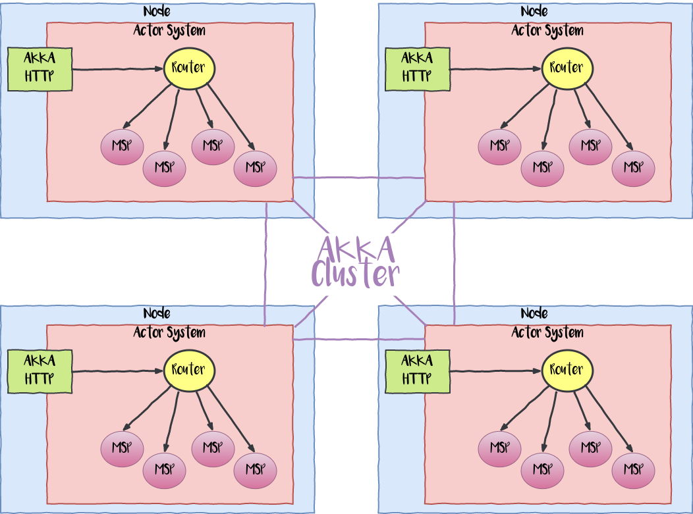
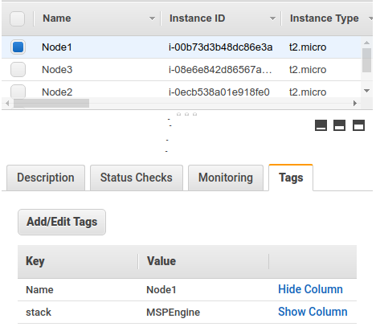

# Akka Cluster Sharding with Http & Kryo Serialization Example

This is an example application that shows how to use the Akka Toolkit combining:

* [Akka Http](https://doc.akka.io/docs/akka-http/current/index.html)
* [Akka Cluster](https://doc.akka.io/docs/akka/current/common/cluster.html)
* [Cluster Sharding](https://doc.akka.io/docs/akka/current/cluster-sharding.html)
* [Actor Message Serialization](https://doc.akka.io/docs/akka/2.5.4/scala/serialization.html) employing  [Kryo](https://github.com/EsotericSoftware/kryo) (using the [twitter-chill](https://github.com/twitter/chill) extension for akka)
* [Akka Cluster Bootstrap](https://doc.akka.io/docs/akka-management/current/bootstrap/index.html) ([Config](https://doc.akka.io/docs/akka-management/current/bootstrap/local-config.html) & [AWS](https://doc.akka.io/docs/akka-management/current/discovery/aws.html))

## Scenario
The example is inspired by the implementation of the [Markreator &reg;](https://markreator.com) marketplaces engine, that allows to define and run [Multi Sided Platforms](https://en.wikipedia.org/wiki/Two-sided_market) (**MSP**) in a [SaaS](https://en.wikipedia.org/wiki/Software_as_a_service) fashion.

The Engine for the MSPs (**MSPEngine**):
* Is a System build as [Reactive System](https://www.reactivemanifesto.org/) (" ... more flexible, loosely-coupled and scalable ...").
* Provides the MSPs functionality through [REST APIs](https://en.wikipedia.org/wiki/Representational_state_transfer) with replicated Http Listeners.
* Supports MSPs operations that can be distributed over multiple nodes using separated [workers](https://letitcrash.com/post/29044669086/balancing-workload-across-nodes-with-akka-2). (For this case, the **Ping / Pong** operations.)
* Allows MSPs operations for multiple [stateful entities](https://manuel.bernhardt.io/2018/02/26/tour-akka-cluster-cluster-sharding/). (For this case, the **Reservation & Availability** operations.)

The bellow figure shows the MSPEngine Architecture:



## Configuration
In this example all the nodes have the same role with the following configuration: 

* Clustering capabilities (Default - interface / 2552 port)
```yaml
akka {
  actor.provider = cluster
  remote.artery {
        enabled = on
        transport = tcp
        canonical.hostname = "127.0.0.1"
        canonical.port = 2552
  }
}
```

* Cluster Bootstrap provided by Akka Management (Default - interface / 8558 port)
```yaml
akka.management {
  http.hostname = "127.0.0.1"
  http.port = 8558
  cluster.bootstrap {
    contact-point-discovery {
      service-name = "MSPEngine"
      discovery-method = config
    }
  }
}
```

* Http Listening (Default - interface / 8080 port)
```yaml
akka.http.server.default-http-port = 8080
```

* Defined *Router* that routes to a predefined *MSPs*
```yaml
akka.actor.deployment {
  /Router/MSP {
    router = cluster-metrics-adaptive-group
    metrics-selector = mix
    routees.paths = ["/user/MSP"]
    cluster {
      enabled = on
      allow-local-routees = on
    }
  }
}
```
## Deployment

After the project [assembling](https://github.com/sbt/sbt-assembly) the solution is ready to run using the script [startNode.sh](startNode.sh) for local deployment and [startNodeAWS.sh](startNodeAWS.sh) for [AWS-EC2](https://aws.amazon.com/ec2/) deployment.
```bash
> sbt assembly
[info] ...
[info] Packaging target/scala-2.12/MSPEngine-assembly-1.0.0.jar ...
[info] Done packaging.
```   
### Local Deployment
The initial deployment is focused in a local environment for a cluster with two nodes:

```yaml
akka.discovery.config.services.MSPEngine {
  endpoints = [
    {host = "127.0.0.1", port = 8558},
    {host = "127.0.0.2",port = 8558}
  ]
}
```

In the first terminal
```bash
> sh startNode.sh 127.0.0.1
...
[INFO] Cluster Node [akka://MSPEngine@127.0.0.1:2552] - Leader is moving node [akka://MSPEngine@127.0.0.2:2552] to [Up]
```

In the second terminal
```bash
> sh startNode.sh 127.0.0.2
...
[INFO] Cluster Node [akka://MSPEngine@127.0.0.2:2552] - Welcome from [akka://MSPEngine@127.0.0.1:2552]
[INFO] Cluster Ready !
```

We can use the [Cluster Http Management](https://doc.akka.io/docs/akka-management/current/cluster-http-management.html) to check the cluster status

```bash
> curl 'http://127.0.0.1:8558/cluster/members'
```
```json
{
  "leader": "akka://MSPEngine@127.0.0.1:2552",
  "members": [
    {
      "node": "akka://MSPEngine@127.0.0.1:2552",
      "nodeUid": "7860653098160952911",
      "roles": [
        "dc-default"
      ],
      "status": "Up"
    },
    {
      "node": "akka://MSPEngine@127.0.0.2:2552",
      "nodeUid": "681425564094778613",
      "roles": [
        "dc-default"
      ],
      "status": "Up"
    }
  ],
  "oldest": "akka://MSPEngine@127.0.0.1:2552",
  "oldestPerRole": {
    "dc-default": "akka://MSPEngine@127.0.0.1:2552"
  },
  "selfNode": "akka://MSPEngine@127.0.0.1:2552",
  "unreachable": []
}
```

```bash
> curl 'http://127.0.0.2:8558/cluster/members'
```
```json
{
  "leader": "akka://MSPEngine@127.0.0.1:2552",
  "members": [
    {
      "node": "akka://MSPEngine@127.0.0.1:2552",
      "nodeUid": "7860653098160952911",
      "roles": [
        "dc-default"
      ],
      "status": "Up"
    },
    {
      "node": "akka://MSPEngine@127.0.0.2:2552",
      "nodeUid": "681425564094778613",
      "roles": [
        "dc-default"
      ],
      "status": "Up"
    }
  ],
  "oldest": "akka://MSPEngine@127.0.0.1:2552",
  "oldestPerRole": {
    "dc-default": "akka://MSPEngine@127.0.0.1:2552"
  },
  "selfNode": "akka://MSPEngine@127.0.0.2:2552",
  "unreachable": []
}
```

### AWS EC2 Deployment
This deployment is dedicated to EC2 Instances in AWS applying [AWS API - EC2 Tag-Based Discovery](https://doc.akka.io/docs/akka-management/current/discovery/aws.html)
```yaml
akka.management.cluster.bootstrap.contact-point-discovery.discovery-method = aws-api-ec2-tag-based
akka.discovery.aws-api-ec2-tag-based.tag-key="stack"
```
In each EC2 instance the following files must be placed:
* **Assembly**: MSPEngine-assembly-1.0.0.jar
* **Config**: application.conf and serialization.conf
* **Script**: startNodeAWS.sh

We are ready to run each node cluster
```bash
> sh startNodeAWS.sh
...
[INFO] ... [akka.actor.ActorSystemImpl(MSPEngine)] Cluster Ready !
```

```bash
> curl 'http://172.31.53.241:8558/cluster/members'
```
**Note**: In this case, the assigned IP for the used EC2 instance is 172.31.53.241
```json
{
  "leader": "akka://MSPEngine@172.31.50.224:2552",
  "members": [
    {
      "node": "akka://MSPEngine@172.31.50.224:2552",
      "nodeUid": "-8383379762935337666",
      "roles": [
        "dc-default"
      ],
      "status": "Up"
    },
    {
      "node": "akka://MSPEngine@172.31.52.51:2552",
      "nodeUid": "1758942972031486105",
      "roles": [
        "dc-default"
      ],
      "status": "Up"
    },
    {
      "node": "akka://MSPEngine@172.31.53.241:2552",
      "nodeUid": "2651695449179383842",
      "roles": [
        "dc-default"
      ],
      "status": "Up"
    }
  ],
  "oldest": "akka://MSPEngine@172.31.50.224:2552",
  "oldestPerRole": {
    "dc-default": "akka://MSPEngine@172.31.50.224:2552"
  },
  "selfNode": "akka://MSPEngine@172.31.53.241:2552",
  "unreachable": []
}
```

There exist three instances with the deployment



## Functionality
The System recreates an theoretical Marketplace dedicated to promote and commercialize [Scala-Lang Events](https://www.scala-lang.org/events/).  The program is defined by configuration
```yaml
ksmti.poc.scalaEvents = [
  {
    name = "REACTIVE SUMMIT"
    location = "MONTREAL, QC, CANADA"
    date = "20 October 2018 - 24 October 2018"
    stock = 1500
    price = 120
  },
  {
    name = "LAMBDA WORLD"
    location = "CÁDIZ, SPAIN"
    date = "25 October 2018 - 26 October 2018"
    stock = 800
    price = 140
  },
  {
    name = "SCALA.IO"
    location = "LYON, FRANCE"
    date = "29 October 2018 - 31 October 2018"
    stock = 1300
    price = 180
  },
  {
    name = "SCALE BY THE BAY"
    location = "SAN FRANCISCO, CA, USA"
    date = "15 November 2018 - 17 November 2018"
    stock = 2000
    price = 120
  },
  {
    name = "SCALA EXCHANGE"
    location = "LONDON, UK"
    date = "13 December 2018 - 14 December 2018"
    stock = 1300
    price = 250
  }
]
```

The supported operations includes:
* Consult the Scala Events Program
* Check Scala Events Tickets Availability
* Book Reservations for Scala Events Tickets

### Consult the Scala Events Program
This functionality provides a defined Scala Events Program:
```bash
> curl -w "\n" 'http://127.0.0.1:8080/upcomingEvents'
```
Or 
```bash
> curl -w "\n" 'http://127.0.0.2:8080/upcomingEvents'
```
Produces
```json
{
  "program": [
    {
      "date": "20 October 2018 - 24 October 2018",
      "location": "MONTREAL, QC, CANADA",
      "name": "REACTIVE SUMMIT",
      "price": 120,
      "stock": 1500
    },
    {
      "date": "25 October 2018 - 26 October 2018",
      "location": "CÁDIZ, SPAIN",
      "name": "LAMBDA WORLD",
      "price": 140,
      "stock": 800
    },
    {
      "date": "29 October 2018 - 31 October 2018",
      "location": "LYON, FRANCE",
      "name": "SCALA.IO",
      "price": 180,
      "stock": 1300
    },
    {
      "date": "15 November 2018 - 17 November 2018",
      "location": "SAN FRANCISCO, CA, USA",
      "name": "SCALE BY THE BAY",
      "price": 120,
      "stock": 2000
    },
    {
      "date": "13 December 2018 - 14 December 2018",
      "location": "LONDON, UK",
      "name": "SCALA EXCHANGE",
      "price": 250,
      "stock": 1300
    }
  ],
  "timeStamp": "2019-06-15T04:45:58"
}
```

It is related with the initial API [routes](https://doc.akka.io/docs/akka-http/current/routing-dsl/overview.html):
```scala
path("upcomingEvents") {
  get {
    onComplete(router ? ConsultProgram) {

      case Success(events: ScalaEvents) =>
        complete(events)

      case _ ⇒
        complete(StatusCodes.InternalServerError)
      }
  }
}
```

A worker per request is executed


Performing multiple requests over the same http listener, the Akka Cluster will distribute load.  Using the [Apache HTTP server benchmarking tool](https://httpd.apache.org/docs/2.4/programs/ab.html) tool
 ```bash
 > ab -c 100 -n 10000 'http://127.0.0.1:8080/upcomingEvents'
 ```

### Check Scala Events Tickets Availability
This functionality allows to consult the tickets stock for a defined Scala Event.
```bash
> curl -w "\n" 'http://127.0.0.1:8080/ticketsStock?event=SCALA.IO'
```


